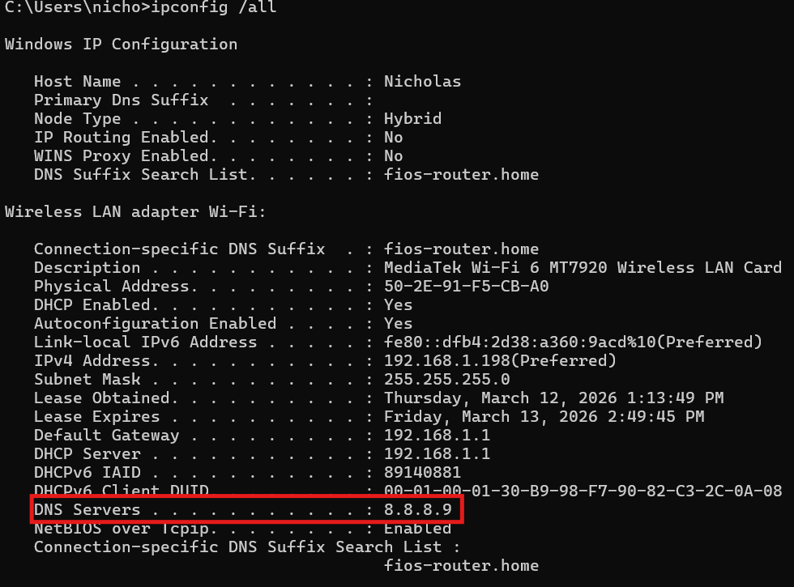
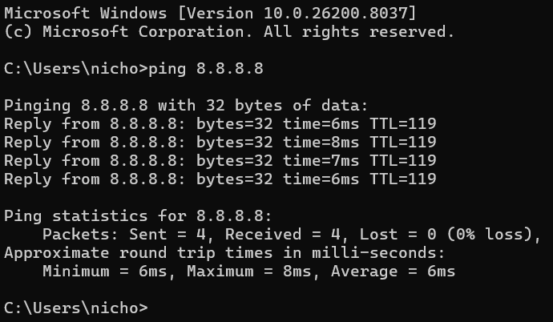
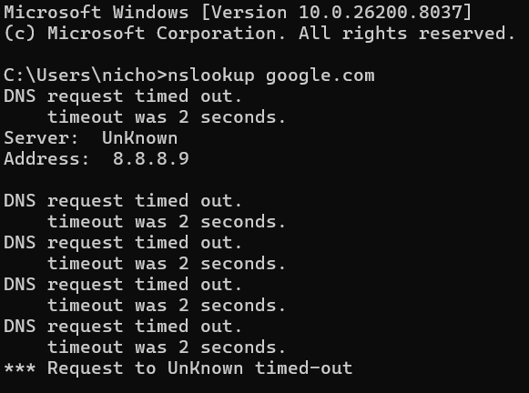
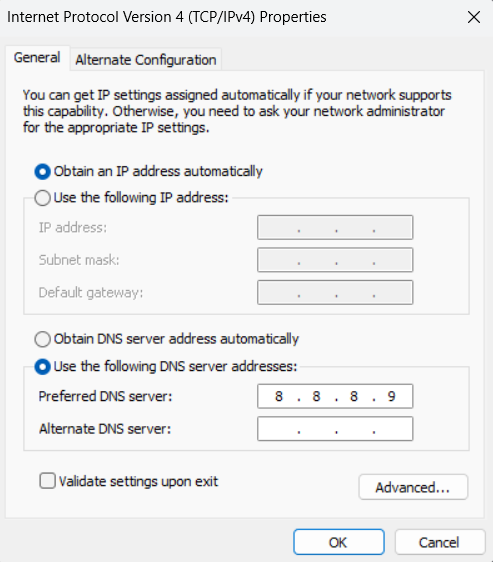
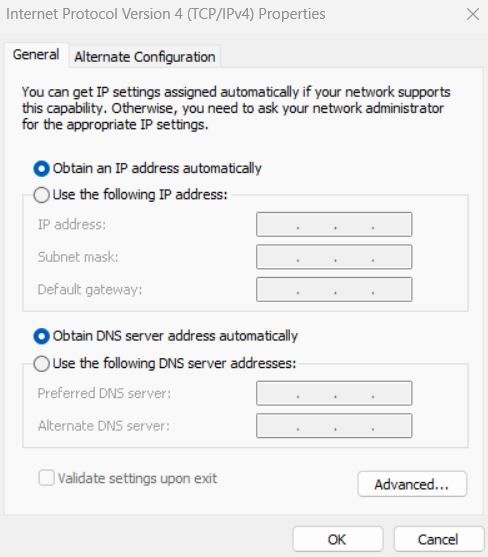
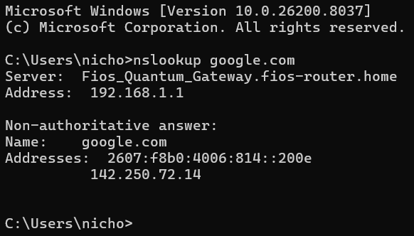

# Lab2: DNS Failure Misconfiguration

## Ticket

User reports that websites are not loading, but the network connection appears to be active.

## Objective 

Identify and diagnose a DNS resolution failure using basic networking tools.

## Tools Used 
```
- ipconfig
- ping
- nslookup 
```

## Investigation Process 

# 1. Command ipconfig

### Command used:
```
ipconfig /All
```

### Screenshot 


In this first step we see a valid IPv4 address, Subnet Mask, and Default Gateway, but an invalid DNS address.

# 2.command ping

### Command used
```
 ping 8.8.8.8
```
### Screenshot
 

Once we performed a ping using only the IP address, the connection was successful.

# 3.Command nslookup

### Command used: 
```
nslookup google.com
```
### Screenshot


We confirmed a DNS failure because the DNS server was unable to resolve the domain name

# Diagnosis 

Network connectivity is operational, but DNS resolution is failing due to an incorrect DNS configuration.

# Root Cause

The issue was caused by an incorrect DNS server configuration.
The system was configured to use the DNS address 8.8.8.9, which is not a valid DNS server. As a result, domain name resolution failed.

# Solution Process 

Knowing that the operating system is Windows 11, follow these steps to solve:

- Control Panel 
- Network and Internet
- Network Sharing Center
- Connections
- Properties  
- (TCP / IPv4) 
- Properties

## Final Window

### Screenshot 


As we can see, the "Preferred DNS server" is configured with the IP address 8.8.8.9, which is not a valid DNS server.

# 1. Step Solution 

Change 8.8.8.9 to the option "Obtain DNS server address automatically"

### Screenshot


# Confirmation 

### screenshot 


Using the **"nslookup google.com"** command again, we confirm that DNS resolution is functioning.

# Conclusion

This lab showed that a system can have working network connectivity but still fail to access websites if DNS is misconfigured. Basic troubleshooting tools such as **ipconfig**, **ping**, and **nslookup** helped identify that the issue was related to an incorrect DNS server. After correcting the DNS configuration, domain name resolution worked properly again.