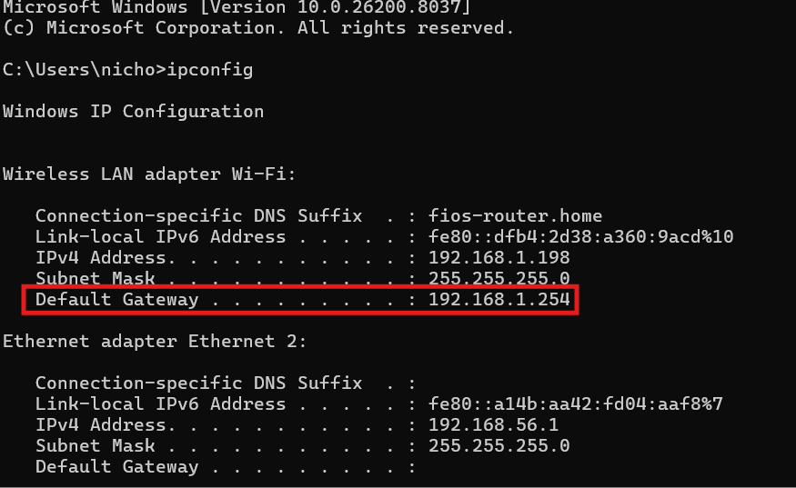

# Lab3: Gateway Misconfiguration

## Ticket

User reports that they cannot access the internet even though the network adapter appears to be connected.

## Objective

Identify and diagnose a network connectivity issue caused by an incorrect default gateway configuration.

## Tools Used 
```
- ipconfig
- ping
- tracert
```

## Investigation process 

# 1. Check IP Configuration

### Command Used:
```
ipconfig
```

### Screenshot

we can see a valid IP and subnet mask, but apparently with a incorrect default gateway.

# 2. Test local TCP/IP 

### Command Used
```
ping 127.0.0.1
```

### Screenshot
image

This confirms that the local TCP/IP stack is functioning correctly.

# 3. Ping To "Default Gateway"

### Command Used
```
ping 192.168.1.254
```

### Screenshot
image

 The system cannot reach the configured *"Default Gateway"*, suggesting that gateway may be incorrect.

# 4. Ping To Internet 

### Command Used
```
ping 8.8.8.8
```

### Screenshot
image

External connectivity fails, indicating that traffic cannot be routed outside.

# 5. Trace to Route to an External Host

### Command Used
```
tracert 8.8.8.8
```

### Screenshot
image

Trace route fails at the first hop indicating that system cannot reach *Gateway*.

# Diagnosis

Internet adapter appears to be connected, but internet connection fails.  Traceroute fails at the first hope indicating a *Gateway Misconfiguration*. 
# Root Cause

The default gateway was incorrectly configured, preventing the system from routing traffic outside the local network.


# Resolution
The correct default gateway was restored.

## Before 

### Screenshot
image

## After

### Screenshot
image

Correct configuration:

Default Gateway: 192.168.1.1

After correcting the configuration, network connectivity was restored.

# Verification 

### Command used 
```
ping 8.8.8.8
```
image

Now system reach the configured gateway 

# Conclusion

The issue was caused by an incorrect default gateway configuration. 
Once the correct gateway was configured, the system was able to route traffic outside the local network.