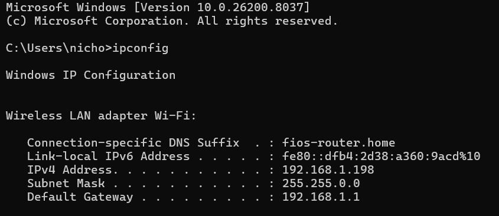
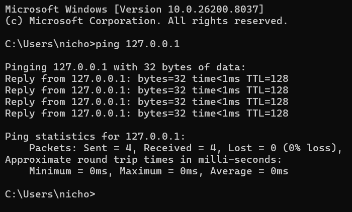
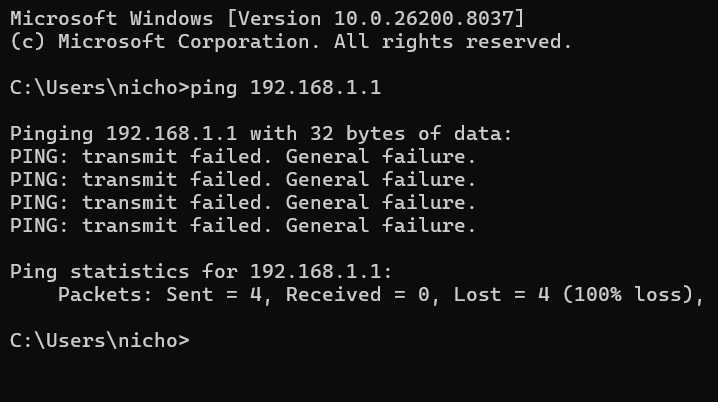
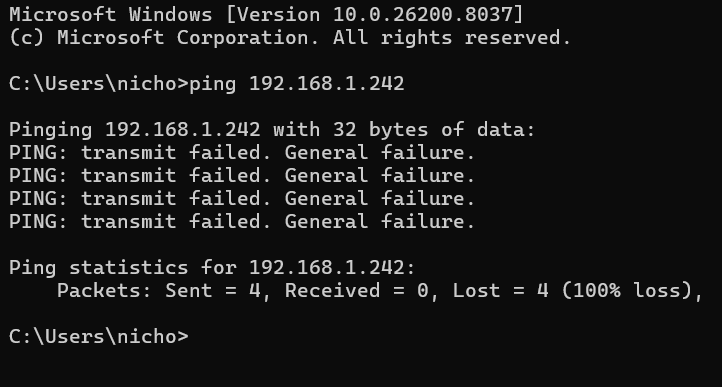
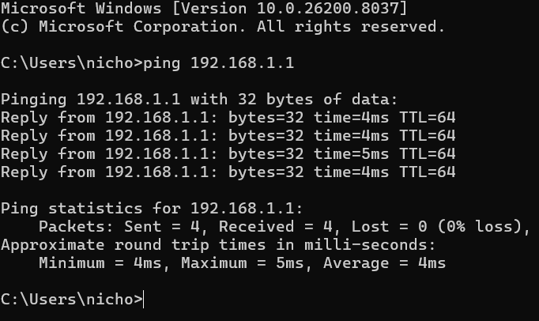

# Lab4: Subnet Mask Misconfiguration

## Ticket 

User reports that they cannot communicate with other devices on the same network.
Objective
Identify and diagnose a network connectivity issue caused by an incorrect subnet mas configuration

## Tools Used 

```
ipconfig
ping
```

## Investigation Process 


# 1. Check IP Configuration 

### Command Used 

```
ipconfig
```

### Screenshot 


The system has a valid IP address, but the subnet mask is incorrectly configured, which may affect communication within the local network.


# 2. Test Local TCP/IP 

### Command Used 
```
ping 127.0.0.1
```
### Screenshot


The local TCP/IP stack is functioning correctly.

# 3. Test Connectivity to Gateway

### Command Used 
```
ping 198.168.1.1
```

### Screenshot


Connectivity to the local gateway may be inconsistent or fail due to incorrect subnet interpretation.

# 4. Test Connectivity to Another Local Host 

### Command Used
```
ping 198.168.1.242
```

### Screenshot


The system may fail to properly identify local vs remote networks due to incorrect subnet mask.

# Diagnosis

he system has an incorrect subnet mask, causing improper network segmentation and communication issues.

# Root Cause

The subnet mask was incorrectly configured, leading to improper network identification.

# Resolution

Correct subnet mask:
```
Subnet Mask: 255.255.255.0
```

# Verification 

### Command Used 
```
ping 192.168.1.1
```

### Screenshot


# Conclusion 
The issue was caused by an incorrect subnet misconfiguration. 

After correcting the subnet mask, normal local network communication was restored.

